# Context-Space-Backend: MCP Adapter Configuration Guide

> **Language / 语言**: [English](README.md) | [简体中文](README_zh_CN.md)

## 🏗️ MCP Adapter Architecture

The MCP adapter system enables seamless integration with any stdio-based MCP server while maintaining security and flexibility through its sophisticated configuration mapping system.

### Core Components

- **MCP Adapter**: Main orchestrator that manages tool discovery and operation execution
- **Config Builder**: Dynamically constructs MCP client configurations with credential/parameter injection
- **Credential Manager**: Securely handles credential extraction and mapping
- **Parameter Mapper**: Manages dynamic parameter injection during operation execution

## 🔧 Configuration Concepts

### The Four Pillars of MCP Configuration

The MCP adapter configuration is built on four interconnected components that work together to provide secure, flexible integration:

#### 1. **CredentialMappings** 🔑
Maps credential fields from Context-Space to MCP server configuration targets.

#### 2. **DummyCredentials** 🎭  
Provides placeholder credentials for tool discovery phase when real credentials aren't needed.

#### 3. **ParameterMappings** 📋
Maps operation parameters to MCP server environment variables or command arguments.

#### 4. **DummyParameters** 🔧
Provides default parameter values for initialization when real parameters aren't available.

### Configuration Override Flow

```mermaid
sequenceDiagram
    participant CS as Context Space
    participant MA as MCP Adapter
    participant CB as Config Builder
    participant MS as MCP Server
    
    Note over CS,MS: 🔄 Initialization Phase
    CS->>MA: Start Adapter
    MA->>CB: Use DummyCredentials + DummyParameters
    CB->>MS: Build Initial Config
    MS-->>MA: Return Tool List
    MA->>MA: Cache Tool Information
    
    Note over CS,MS: 🚀 Runtime Phase
    CS->>MA: Execute Operation (Real Credentials + Parameters)
    MA->>CB: Apply CredentialMappings
    CB->>CB: Override: Dummy → Real
    MA->>CB: Apply ParameterMappings  
    CB->>CB: Override: Dummy → Real
    CB->>MS: Build Dynamic Config
    MS-->>MA: Return Operation Result
    MA-->>CS: Return Final Result
```



## 🛠️ Configuration Tutorial

### Basic Configuration Structure

```go
type MCPAdapterConfig struct {
    Command            string            `json:"command"`             // Execution command (npx, uvx, ./binary)
    Args               []string          `json:"args"`                // Command arguments
    Envs               map[string]string `json:"envs"`                // Environment variables
    Timeout            time.Duration     `json:"timeout"`             // Operation timeout
    
    // 🔑 Core Mapping Configuration
    CredentialMappings map[string]string `json:"credential_mappings"` // Credential field → Target location
    DummyCredentials   map[string]string `json:"dummy_credentials"`   // Placeholder credentials
    ParameterMappings  map[string]string `json:"parameter_mappings"`  // Parameter field → Target location
    DummyParameters    map[string]string `json:"dummy_parameters"`    // Default parameters
}
```

### Mapping Target Formats

| Format | Description | Security | Use Case |
|--------|-------------|----------|----------|
| `env:VAR_NAME` | Map to environment variable | 🔒 High | API keys, passwords, connection strings |
| `arg:PLACEHOLDER` | Replace argument placeholder | 🔓 Low | Public config, file paths |
| `arg:--flag ${value}` | Format as flag argument | 🔓 Low | Command line options |
| `arg:--key=${value}` | Format as key-value argument | 🔓 Low | Configuration items |

## 📋 Practical Examples

### Example 1: GitHub Integration (Simple Credential Mapping)

```go
"github_mcp": {
    Identifier: "github_mcp",
    DefaultConfig: MCPAdapterConfig{
        Command: "npx",
        Args:    []string{"-y", "@modelcontextprotocol/server-github"},
        
        // Map GitHub API key to environment variable
        CredentialMappings: map[string]string{
            "api_key": "env:GITHUB_PERSONAL_ACCESS_TOKEN",
        },
        
        // Dummy value for tool discovery
        DummyCredentials: map[string]string{
            "api_key": "dummy_github_token_for_initialization",
        },
        
        Timeout: 60 * time.Second,
    },
}
```

#### **Configuration Flow for GitHub Example**

**Initialization Phase:**
1. **Source**: `DummyCredentials.api_key = "dummy_github_token_for_initialization"`
2. **Mapping**: `CredentialMappings.api_key ==> "env:GITHUB_PERSONAL_ACCESS_TOKEN"`
3. **Result**: Environment variable `GITHUB_PERSONAL_ACCESS_TOKEN=dummy_github_token_for_initialization`
4. **Effect**: MCP server starts and returns available tools

**Runtime Phase:**
1. **Source**: Real `APIKeyCredential.APIKey = "ghp_xxxxxxxxxxxx"`
2. **Mapping**: Same `CredentialMappings.api_key ==> "env:GITHUB_PERSONAL_ACCESS_TOKEN"`
3. **Result**: Environment variable `GITHUB_PERSONAL_ACCESS_TOKEN=ghp_xxxxxxxxxxxx` (overrides dummy)
4. **Effect**: MCP operations execute with real credentials

### Example 2: Complex Parameter Mapping (Bookstore Server)

```go
"bookstore_mcp": {
    Identifier: "bookstore_mcp",
    DefaultConfig: MCPAdapterConfig{
        Command: "npx",
        Args:    []string{"-y", "@example/bookstore-server", "BASE_PATH", "--config", "CONFIG_FILE"},
        
        // Credential mappings
        CredentialMappings: map[string]string{
            "api_key":  "env:BOOKSTORE_API_KEY",
            "store_id": "arg:--store-id ${value}",
        },
        
        // Parameter mappings for dynamic operation configuration
        ParameterMappings: map[string]string{
            "book_name":   "env:TARGET_BOOK",               // → Environment variable
            "store_name":  "arg:--target-store ${value}",   // → Formatted argument
            "config_file": "arg:CONFIG_FILE",               // → Replace placeholder
            "base_path":   "arg:BASE_PATH",                 // → Replace placeholder
        },
        
        // Initialization dummy values
        DummyCredentials: map[string]string{
            "api_key":  "dummy_bookstore_api_key",
            "store_id": "dummy_store_123",
        },
        
        DummyParameters: map[string]string{
            "base_path":   "/tmp/bookstore",
            "config_file": "/default/config.json",
            "book_name":   "dummy_book",
            "store_name":  "dummy_store",
        },
    },
}
```

### Example 3: Time Server (Environment + Arguments)

```go
"time_mcp": {
    Identifier: "time_mcp",
    DefaultConfig: MCPAdapterConfig{
        Command: "uvx",
        Args:    []string{"mcp-server-time@2025.7.1", "--local-timezone", "UTC"},
        Envs: map[string]string{
            "TZ": "UTC", // System timezone fallback
        },
        Timeout: 90 * time.Second,
    },
}
```

### Example 4: Database Server (Multi-Credential Type)

```go
"database_mcp": {
    Identifier: "database_mcp", 
    DefaultConfig: MCPAdapterConfig{
        Command: "npx",
        Args:    []string{"-y", "@example/database-server"},
        
        // Support for BasicAuth credentials
        CredentialMappings: map[string]string{
            "username": "env:DB_USERNAME",
            "password": "env:DB_PASSWORD", 
            "host":     "arg:--host ${value}",
            "port":     "arg:--port ${value}",
        },
        
        // Dynamic database operation parameters
        ParameterMappings: map[string]string{
            "database_name": "env:DATABASE_NAME",
            "query_timeout": "arg:--timeout ${value}",
            "ssl_mode":      "arg:--ssl-mode ${value}",
        },
        
        // Safe dummy values for initialization
        DummyCredentials: map[string]string{
            "username": "dummy_user",
            "password": "dummy_pass", 
            "host":     "localhost",
            "port":     "5432",
        },
        
        DummyParameters: map[string]string{
            "database_name": "dummy_db",
            "query_timeout": "30",
            "ssl_mode":      "disable",
        },
    },
}
```

## 🔒 Security Best Practices

### Credential Mapping Strategy

```mermaid
graph TD
    subgraph "Security Levels"
        A[🔒 High Security<br/>Environment Variables]
        B[🔓 Medium Security<br/>Command Arguments] 
        C[❌ Low Security<br/>Process List Visible]
    end
    
    subgraph "Recommended Mappings"
        D[API Keys → env:API_KEY]
        E[Passwords → env:PASSWORD]
        F[Tokens → env:ACCESS_TOKEN]
        G[Public IDs → arg:--client-id]
        H[File Paths → arg:--config]
        I[Feature Flags → arg:--enable-feature]
    end
    
    A --> D
    A --> E  
    A --> F
    B --> G
    B --> H
    B --> I
    
    style A fill:#c8e6c9
    style B fill:#fff3e0
    style C fill:#ffebee
```



### ✅ Secure Configuration Examples

```go
// ✅ GOOD: Sensitive data via environment variables
CredentialMappings: map[string]string{
    "api_key":    "env:SECRET_API_KEY",        // Won't appear in process list
    "password":   "env:DATABASE_PASSWORD",     // Secure transmission
    "public_id":  "arg:--client-id ${value}",  // Public info can use args
}

// ❌ BAD: Sensitive data exposed in command line
CredentialMappings: map[string]string{
    "api_key":  "arg:--api-key ${value}",     // Visible in `ps` command
    "password": "arg:--password ${value}",    // Extremely insecure
}
```

### Dummy Value Design Principles

```go
// ✅ GOOD: Obviously fake but properly formatted
DummyCredentials: map[string]string{
    "api_key": "dummy_api_key_12345",
    "token":   "test_token_placeholder",
    "secret":  "dummy_secret_for_init",
}

// ❌ BAD: Could be mistaken for real values  
DummyCredentials: map[string]string{
    "api_key": "sk-1234567890abcdef",  // Looks like real OpenAI key
    "token":   "github_pat_1234",      // Looks like real GitHub token
}
```

## 🔄 Runtime Workflow

### Complete Operation Lifecycle


## 🐛 Troubleshooting Guide

### Common Issues and Solutions

#### 1. Tool Discovery Fails

**Symptom**: `failed to get tools from MCP server`

**Possible Causes**:
- Incorrect dummy credential format
- MCP server cannot start with dummy values

**Solution**:
```go
// Ensure dummy credentials match server expectations
DummyCredentials: map[string]string{
    "api_key": "dummy_but_valid_format_key", // Must be properly formatted
}
```

#### 2. Credential Injection Not Working

**Symptom**: Operations execute with dummy credentials

**Debugging Steps**:
1. Verify credential type matches mapping keys
2. Check credential extraction logic
3. Ensure mapping format is correct

```go
// Ensure mapping keys match credential struct fields
CredentialMappings: map[string]string{
    "api_key": "env:REAL_API_KEY", // Must match APIKeyCredential.APIKey field
}
```

#### 3. Parameter Mapping Ineffective

**Symptom**: Parameters not passed correctly to MCP server

**Debug Checklist**:
- [ ] Parameter names match operation definitions
- [ ] Mapping format syntax is correct  
- [ ] Dummy parameters are provided for all mappings

```go
// Debug configuration
ParameterMappings: map[string]string{
    "file_path": "arg:--file ${value}",  // Ensure operation has file_path parameter
}
DummyParameters: map[string]string{
    "file_path": "/tmp/dummy.txt",       // Provide corresponding dummy value
}
```

### Debug Mode

Enable comprehensive logging to trace credential and parameter mapping:

```bash
export DEBUG=mcp:*
export LOG_LEVEL=debug
```

## 🎯 Summary

The MCP adapter's dynamic mapping system provides:

1. **Secure Credential Management**: Dummy values for initialization, real credentials for execution
2. **Flexible Parameter Configuration**: Multiple mapping formats and injection methods
3. **Simplified Integration Process**: Automated credential and parameter handling  
4. **Strong Security**: Sensitive information passed via environment variables
5. **High Performance**: Permanent caching and thread-safe concurrent execution

Through proper configuration of these four core components (CredentialMappings, DummyCredentials, ParameterMappings, DummyParameters), you can achieve seamless integration with any MCP server while maintaining security and maintainability.

## 🔗 Related Documentation

- [MCP Protocol Specification](https://modelcontextprotocol.io/)
