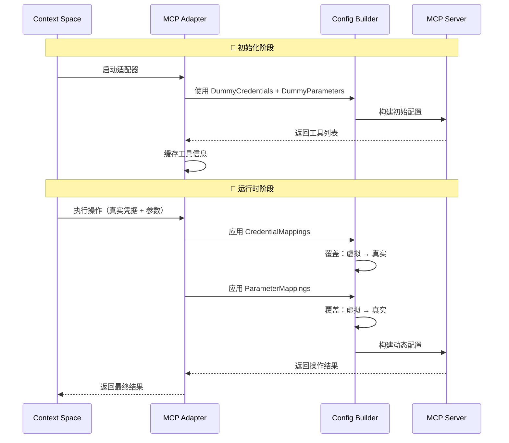
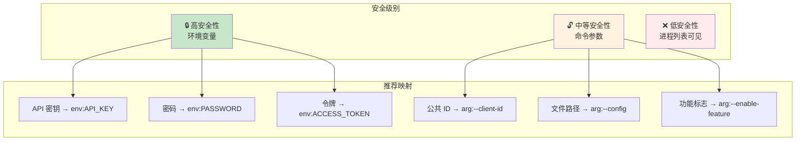
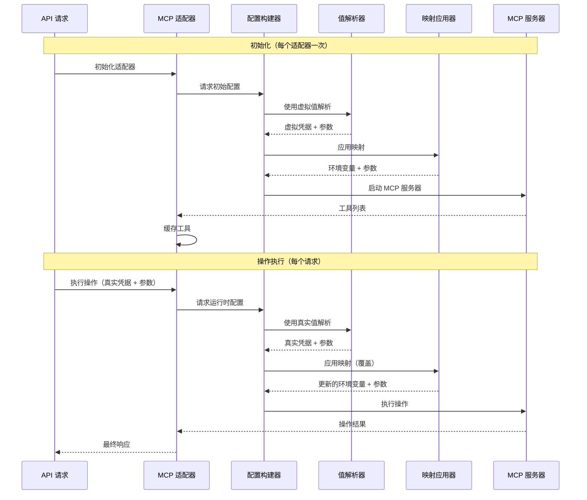

# Context-Space-Backend: MCP Adapter 配置指南

> **Language / 语言**: [English](README.md) | [简体中文](README_zh_CN.md)

## 🏗️ MCP Adapter 架构

MCP 适配器系统通过其复杂的配置映射系统，实现与任何基于 stdio 的 MCP 服务器的无缝集成，同时保持安全性和灵活性。

### 核心组件

- **MCP 适配器 (MCP Adapter)**: 管理工具发现和操作执行的主要协调器
- **配置构建器 (Config Builder)**: 动态构建 MCP 客户端配置，并注入凭据/参数
- **凭据管理器 (Credential Manager)**: 安全处理凭据提取和映射
- **参数映射器 (Parameter Mapper)**: 管理操作执行期间的动态参数注入

## 🔧 配置概念

### MCP 配置的四大支柱

MCP 适配器配置基于四个相互关联的组件构建，它们协同工作以提供安全、灵活的集成：

#### 1. **CredentialMappings（凭据映射）** 🔑
将 Context-Space 的凭据字段映射到 MCP 服务器配置目标。

#### 2. **DummyCredentials（虚拟凭据）** 🎭  
为工具发现阶段提供占位符凭据，当不需要真实凭据时使用。

#### 3. **ParameterMappings（参数映射）** 📋
将操作参数映射到 MCP 服务器环境变量或命令参数。

#### 4. **DummyParameters（虚拟参数）** 🔧
在真实参数不可用时，为初始化提供默认参数值。

### 配置覆盖流程



## 🛠️ 配置教程

### 基本配置结构

```go
type MCPAdapterConfig struct {
    Command            string            `json:"command"`             // 执行命令 (npx, uvx, ./binary)
    Args               []string          `json:"args"`                // 命令参数
    Envs               map[string]string `json:"envs"`                // 环境变量
    Timeout            time.Duration     `json:"timeout"`             // 操作超时时间
    
    // 🔑 核心映射配置
    CredentialMappings map[string]string `json:"credential_mappings"` // 凭据字段 → 目标位置
    DummyCredentials   map[string]string `json:"dummy_credentials"`   // 占位符凭据
    ParameterMappings  map[string]string `json:"parameter_mappings"`  // 参数字段 → 目标位置
    DummyParameters    map[string]string `json:"dummy_parameters"`    // 默认参数
}
```

### 映射目标格式

| 格式 | 描述 | 安全性 | 使用场景 |
|------|------|--------|----------|
| `env:VAR_NAME` | 映射到环境变量 | 🔒 高 | API 密钥、密码、连接字符串 |
| `arg:PLACEHOLDER` | 替换参数占位符 | 🔓 低 | 公共配置、文件路径 |
| `arg:--flag ${value}` | 格式化为标志参数 | 🔓 低 | 命令行选项 |
| `arg:--key=${value}` | 格式化为键值参数 | 🔓 低 | 配置项 |

## 📋 实践示例

### 示例 1: GitHub 集成（简单凭据映射）

```go
"github_mcp": {
    Identifier: "github_mcp",
    DefaultConfig: MCPAdapterConfig{
        Command: "npx",
        Args:    []string{"-y", "@modelcontextprotocol/server-github"},
        
        // 将 GitHub API 密钥映射到环境变量
        CredentialMappings: map[string]string{
            "api_key": "env:GITHUB_PERSONAL_ACCESS_TOKEN",
        },
        
        // 工具发现的虚拟值
        DummyCredentials: map[string]string{
            "api_key": "dummy_github_token_for_initialization",
        },
        
        Timeout: 60 * time.Second,
    },
}
```

#### **GitHub 示例的配置流程**

**初始化阶段：**
1. **源**：`DummyCredentials.api_key = "dummy_github_token_for_initialization"`
2. **映射**：`CredentialMappings.api_key ==> "env:GITHUB_PERSONAL_ACCESS_TOKEN"`
3. **结果**：环境变量 `GITHUB_PERSONAL_ACCESS_TOKEN=dummy_github_token_for_initialization`
4. **效果**：MCP 服务器启动并返回可用工具

**运行时阶段：**
1. **源**：真实 `APIKeyCredential.APIKey = "ghp_xxxxxxxxxxxx"`
2. **映射**：相同 `CredentialMappings.api_key ==> "env:GITHUB_PERSONAL_ACCESS_TOKEN"`
3. **结果**：环境变量 `GITHUB_PERSONAL_ACCESS_TOKEN=ghp_xxxxxxxxxxxx`（覆盖虚拟值）
4. **效果**：MCP 操作使用真实凭据执行

### 示例 2: 复杂参数映射（书店服务器）

```go
"bookstore_mcp": {
    Identifier: "bookstore_mcp",
    DefaultConfig: MCPAdapterConfig{
        Command: "npx",
        Args:    []string{"-y", "@example/bookstore-server", "BASE_PATH", "--config", "CONFIG_FILE"},
        
        // 凭据映射
        CredentialMappings: map[string]string{
            "api_key":  "env:BOOKSTORE_API_KEY",
            "store_id": "arg:--store-id ${value}",
        },
        
        // 动态操作配置的参数映射
        ParameterMappings: map[string]string{
            "book_name":   "env:TARGET_BOOK",               // → 环境变量
            "store_name":  "arg:--target-store ${value}",   // → 格式化参数
            "config_file": "arg:CONFIG_FILE",               // → 替换占位符
            "base_path":   "arg:BASE_PATH",                 // → 替换占位符
        },
        
        // 初始化虚拟值
        DummyCredentials: map[string]string{
            "api_key":  "dummy_bookstore_api_key",
            "store_id": "dummy_store_123",
        },
        
        DummyParameters: map[string]string{
            "base_path":   "/tmp/bookstore",
            "config_file": "/default/config.json",
            "book_name":   "dummy_book",
            "store_name":  "dummy_store",
        },
    },
}
```

### 示例 3: 时间服务器（环境变量 + 参数）

```go
"time_mcp": {
    Identifier: "time_mcp",
    DefaultConfig: MCPAdapterConfig{
        Command: "uvx",
        Args:    []string{"mcp-server-time@2025.7.1", "--local-timezone", "UTC"},
        Envs: map[string]string{
            "TZ": "UTC", // 系统时区回退
        },
        Timeout: 90 * time.Second,
    },
}
```

### 示例 4: 数据库服务器（多凭据类型）

```go
"database_mcp": {
    Identifier: "database_mcp", 
    DefaultConfig: MCPAdapterConfig{
        Command: "npx",
        Args:    []string{"-y", "@example/database-server"},
        
        // 支持 BasicAuth 凭据
        CredentialMappings: map[string]string{
            "username": "env:DB_USERNAME",
            "password": "env:DB_PASSWORD", 
            "host":     "arg:--host ${value}",
            "port":     "arg:--port ${value}",
        },
        
        // 动态数据库操作参数
        ParameterMappings: map[string]string{
            "database_name": "env:DATABASE_NAME",
            "query_timeout": "arg:--timeout ${value}",
            "ssl_mode":      "arg:--ssl-mode ${value}",
        },
        
        // 初始化的安全虚拟值
        DummyCredentials: map[string]string{
            "username": "dummy_user",
            "password": "dummy_pass", 
            "host":     "localhost",
            "port":     "5432",
        },
        
        DummyParameters: map[string]string{
            "database_name": "dummy_db",
            "query_timeout": "30",
            "ssl_mode":      "disable",
        },
    },
}
```

## 🔒 安全最佳实践

### 凭据映射策略



### ✅ 安全配置示例

```go
// ✅ 好的做法: 敏感数据通过环境变量
CredentialMappings: map[string]string{
    "api_key":    "env:SECRET_API_KEY",        // 不会出现在进程列表中
    "password":   "env:DATABASE_PASSWORD",     // 安全传输
    "public_id":  "arg:--client-id ${value}",  // 公共信息可以使用参数
}

// ❌ 不好的做法: 敏感数据暴露在命令行中
CredentialMappings: map[string]string{
    "api_key":  "arg:--api-key ${value}",     // 在 `ps` 命令中可见
    "password": "arg:--password ${value}",    // 极不安全
}
```

### 虚拟值设计原则

```go
// ✅ 好的做法: 明显是假的但格式正确
DummyCredentials: map[string]string{
    "api_key": "dummy_api_key_12345",
    "token":   "test_token_placeholder",
    "secret":  "dummy_secret_for_init",
}

// ❌ 不好的做法: 可能被误认为真实值  
DummyCredentials: map[string]string{
    "api_key": "sk-1234567890abcdef",  // 看起来像真的 OpenAI 密钥
    "token":   "github_pat_1234",      // 看起来像真的 GitHub 令牌
}
```

## 🔄 运行时工作流

### 完整操作生命周期



## 🐛 故障排除指南

### 常见问题和解决方案

#### 1. 工具发现失败

**症状**: `failed to get tools from MCP server`（无法从 MCP 服务器获取工具）

**可能原因**:
- 虚拟凭据格式不正确
- MCP 服务器无法使用虚拟值启动

**解决方案**:
```go
// 确保虚拟凭据符合服务器期望
DummyCredentials: map[string]string{
    "api_key": "dummy_but_valid_format_key", // 必须格式正确
}
```

#### 2. 凭据注入不工作

**症状**: 操作使用虚拟凭据执行

**调试步骤**:
1. 验证凭据类型与映射键匹配
2. 检查凭据提取逻辑
3. 确保映射格式正确

```go
// 确保映射键与凭据结构字段匹配
CredentialMappings: map[string]string{
    "api_key": "env:REAL_API_KEY", // 必须与 APIKeyCredential.APIKey 字段匹配
}
```

#### 3. 参数映射无效

**症状**: 参数没有正确传递给 MCP 服务器

**调试清单**:
- [ ] 参数名称与操作定义匹配
- [ ] 映射格式语法正确  
- [ ] 为所有映射提供虚拟参数

```go
// 调试配置
ParameterMappings: map[string]string{
    "file_path": "arg:--file ${value}",  // 确保操作有 file_path 参数
}
DummyParameters: map[string]string{
    "file_path": "/tmp/dummy.txt",       // 提供对应的虚拟值
}
```

### 调试模式

启用全面日志记录以跟踪凭据和参数映射：

```bash
export DEBUG=mcp:*
export LOG_LEVEL=debug
```

## 🎯 总结

MCP 适配器的动态映射系统提供：

1. **安全凭据管理**: 初始化使用虚拟值，执行时使用真实凭据
2. **灵活参数配置**: 多种映射格式和注入方法
3. **简化集成过程**: 自动化凭据和参数处理  
4. **强安全性**: 敏感信息通过环境变量传递
5. **高性能**: 永久缓存和线程安全的并发执行

通过正确配置这四个核心组件（CredentialMappings、DummyCredentials、ParameterMappings、DummyParameters），您可以实现与任何 MCP 服务器的无缝集成，同时保持安全性和可维护性。

## 🔗 相关文档

- [MCP 协议规范](https://modelcontextprotocol.io/) 